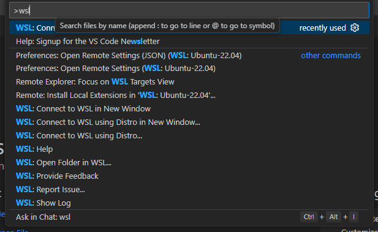
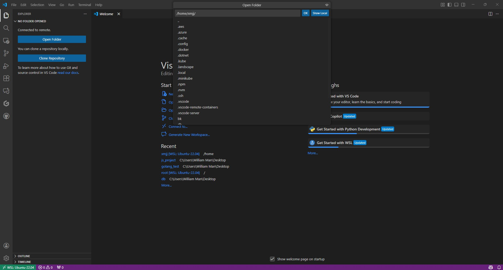
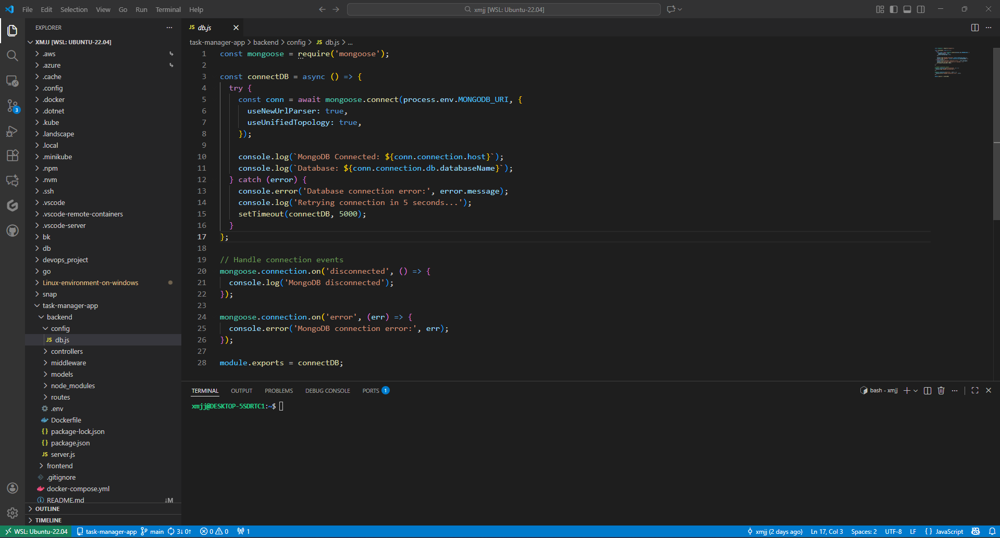

# Quick Start: Setting Up a Linux Development Environment on Windows

This guide provides step-by-step instructions for setting up a Linux development environment on Windows using WSL (Windows Subsystem for Linux).

---

## Installing WSL on Windows

### Initial Installation
Open PowerShell as Administrator and run:
```powershell
wsl --install
```

### View Available Linux Distributions
To see all available Linux distributions:
```powershell
wsl --list --online
```

### Install a Specific Distribution
Replace `[Distro]` with your preferred distribution (e.g., Ubuntu, Debian):
```powershell
wsl --install -d [Distro]
```

### Set Default Distribution
After installation, configure your default WSL distribution:
```powershell
# Set default distribution
wsl --set-default <DistroName>

# Run a specific WSL distribution
wsl --distribution <DistroName>
```

---

## Using VSCode with WSL

### Step 1: Install the WSL Extension
1. Open VSCode
2. Press `Ctrl + Shift + X` to open Extensions
3. Search for "WSL" and install the official "WSL" extension by Microsoft

### Step 2: Connect to WSL
1. Press `F1` to open the command palette
2. Type "WSL" and select **"WSL: Connect to WSL"**



### Step 3: Open Linux Folder in VSCode
1. Click **"Open Folder"** in the Explorer panel
2. Navigate to your desired Linux directory
3. Begin editing files directly within the WSL environment



---

## You're All Set!

Your development environment is now ready. You can:
- Edit files directly in the Linux filesystem
- Drag and drop files between Windows and WSL
- Use integrated terminal with full Linux capabilities



---

## Additional Tips
- Access your WSL terminal directly from VSCode (`Ctrl + ``)
- Install additional extensions in the WSL context for full language support
- Use the remote development features for seamless integration

**Next Steps:** Consider installing development tools like Git, Node.js, or Python directly within your WSL distribution for a complete development environment.